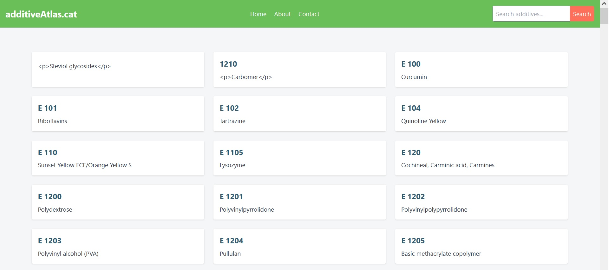
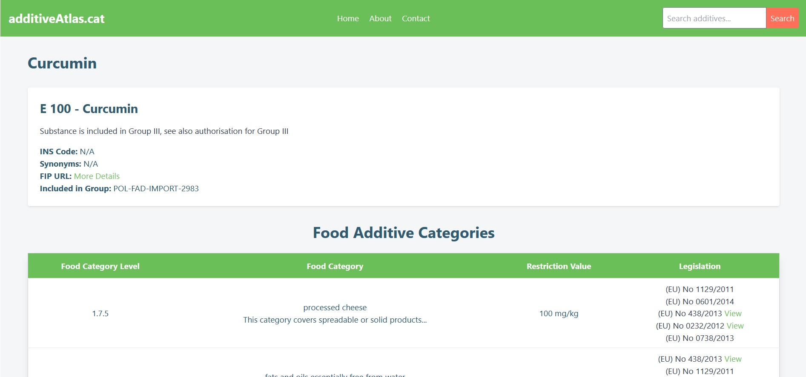
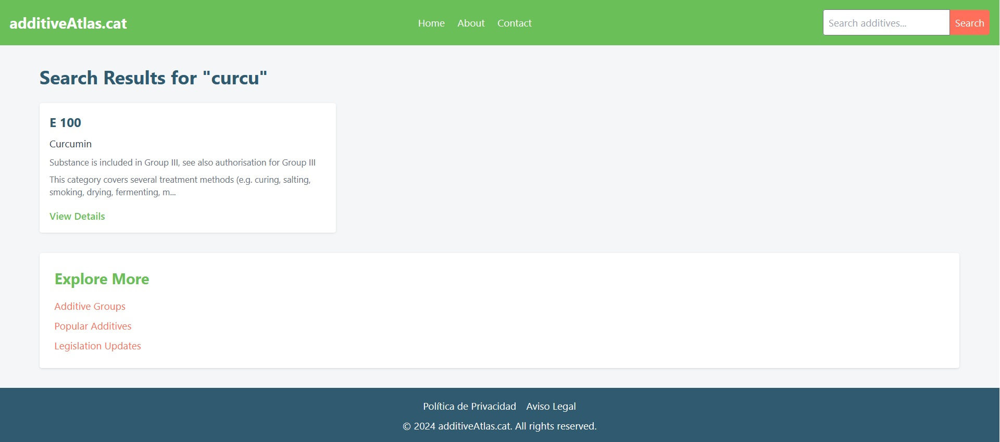

## Pàgina web sobre additius alimentaris
Aquesta web és un exemple per l'assignatura de DAW M7.
Amb la idea de crear una pàgina web amb moltes urls que puguin indexar a Google, monetitzar i per difusió com si fos un projecte real.

## Base de dades
Hem utilitzat la base de dades oficial de l'Unió Europea
[API de la base de dades](https://developer.datalake.sante.service.ec.europa.eu/api-details#api=228d6fda-9092-4c25-af9a-d537666ed0e5&operation=ea5e05d1-f567-4ed2-a316-b9466fd2f6e6)

## Creació del model
Hem creat el model Additive com a classe per importar les dades. També hem fet el seeder que és l'encarregat d'importar les dades

## Vista
A resources > views > layouts > theme.blade.php tenim la plantilla que hem creat com a punt de partida. Utilitzarem plantilles Blade i el sistema d'herència per fer la resta de vistes.

## Routes
Cada cas d'ús anirà en un controlador diferent.

### HomeHome
Controllermostrarà la pàgina d'inici amb el llistat d'additius.

### AdditiveShow
AdditiveController@show mostrarà les dades d'un additiu.

### Search
Implementar el cercador de additius y millorar una mica la vista del AdditiveShow.

### Friendly URL
Millorem l'estructura de la url dels aditius perque quedi millor al cercar a Google

### Sitemap.xml
Crearem un sitemap en format XML per facilitat l'indexació del contingut a Google Search Console.Utilitzarem un controlador específic per aquesta tasca.

### Metadescription
Volem personalitzar la metadescription de la pàgina web perquè sigui adaptada a cada additiu i una mica clikbait.

### Google analytics
Implementem Google Analytics a la web. Modifiqueu l'identificaro 'G-XXXXXXXXXX' que trovarem a la vista layouts.analytics.blade.php

### Adsene, banner
Demanada la validació per part d'Adsense

## Refactorització de la base de dades
A l'inici del projecte vam prendre una decisió per minimitzar el temps de creació de la base de dades, però no era el disseny òptim. Això es coneix com una decisió de disseny que comporta un **deute tècnic**. Això vol dir que ara hem de perdre un temps per reparar aquesta decisió inicial.

## Internacionalització de la base de dades
Gestionem l'idioma amb una variable dins la sessió.
Creem una taula amb les traduccions dels camps de la taula Additive i AdditiveDetail.

## Generar contingut amb IA
Utilitzant la API de Google Gemini generarem contingut pels additius en angles.

## Traduir contingut
Utilitzant una llibreria externa, traduir el contingut de l'angles a la resta d'idiomes.

## Mostrar la vista en diferents idiomes
Els detalls del aditiu canvien d'idioma segons la variable de sessió.

## Sistema de rutes multiidioma
Modificar les rutes per gestionar cada idioma en una carpeta diferent.

## Hreflang
Implementem el sistema de a hreflang per millorar el nostre SEO internacional.

## Captures de pantalla

### Pàgina d'Inici

### Detall d'Aditiu

### Cercador d'Aditius
